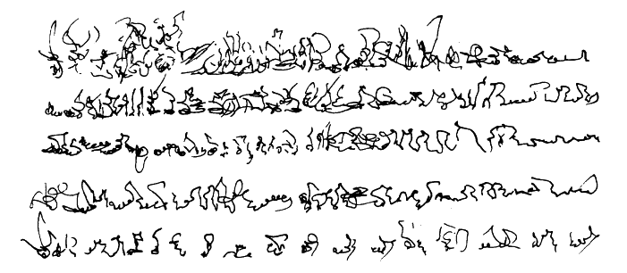

{: .centered}
<i>Narration</i> - Henri Michaux (excerpt, 1927)
<!-- https://asemics.com/henri-michaux-narration-excerpt-1927/ -->

{: .centered}
{: .small}
<a href="begin-reading.html">begin reading -></a>

<!-- {: .code}
this is some code -->

